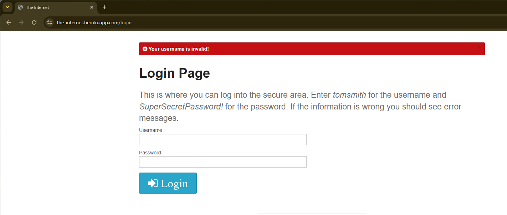

# BUG-001: [Mensaje de error erroneo al no ingresar datos]

**Módulo:** [Form Authentication]
**Caso de prueba relacionado:** [TC-004]
**Severidad:** Baja
**Prioridad:** Media
**Estado:** Abierto

## Ambiente
- **URL:** https://the-internet.herokuapp.com/login
- **Navegador:** Chrome 151.0.7922.138
- **Sistema operativo:** [Windows 11]
- **Fecha:** [2026-10-22]

## Pasos para reproducir
1. Ingresar al enlace `https://the-internet.herokuapp.com/login`
2. Hacer clic en botón `Login`

## Resultado esperado
[Mensaje de validación indicando campos requeridos]

## Resultado actual
[Mensaje de validación indicando nombre de usuario invalido]

## Evidencia

## Notas adicionales
[N/A]

