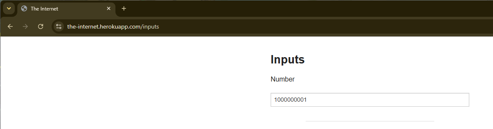

# BUG-002: [Valor positivo grande (999999999) puede ser superado]

**Módulo:** [Inputs (`/inputs`)]
**Caso de prueba relacionado:** [TC-010]
**Severidad:** Media
**Prioridad:** Alta 
**Estado:** Abierto

## Ambiente
- **URL:** https://the-internet.herokuapp.com/inputs
- **Navegador:** Chrome 151.0.7922.138
- **Sistema operativo:** [Windows 11]
- **Fecha:** [2026-10-22]

## Pasos para reproducir
1. Ingresar al enlace `https://the-internet.herokuapp.com/inputs`
2. Ingresar el número `999999999`
3. Hacer clic en el botón de aumentar

## Resultado esperado
[El campo acepta o trunca según comportamiento del navegador]

## Resultado actual
[El campo acepta y permite seguir aumentando el número]

## Evidencia

## Notas adicionales
[N/A]

