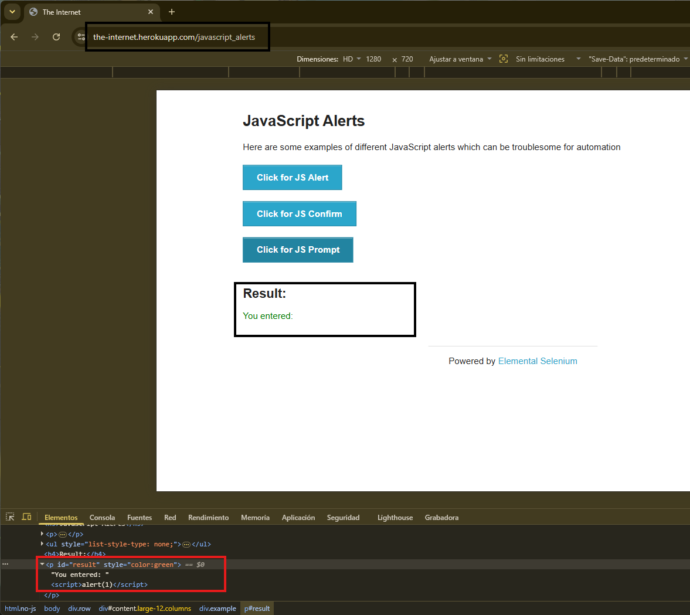

# BUG-003: [Creacion de etiqueta HTML al ingresar `` en un campo de texto]

**Módulo:** [JavaScript Alerts]
**Caso de prueba relacionado:** [TC-022]
**Severidad:** Baja
**Prioridad:** Media
**Estado:** Abierto

## Ambiente
- **URL:** https://the-internet.herokuapp.com/javascript_alerts
- **Navegador:** Chrome 151.0.7922.138
- **Sistema operativo:** [Windows 11]
- **Fecha:** [2026-10-22]

## Pasos para reproducir
1. Ingresar al enlace `https://the-internet.herokuapp.com/javascript_alerts`
2. Hacer clic en botón `Click for JS Prompt`
3. Ingresar el texto `` y aceptar

## Resultado esperado
[El texto se muestra literal como string, sin ejecutarse ni romper la página]

## Resultado actual
[La página funciona con normalidad, pero no se muestra el mensaje como un string, y se crea una nueva etiqueta HTML (ver imágen para más info)]

## Evidencia

## Notas adicionales
[N/A]